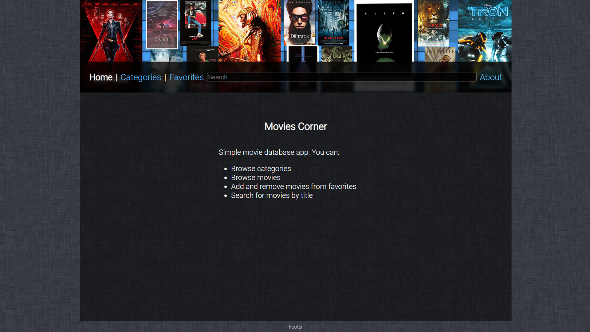
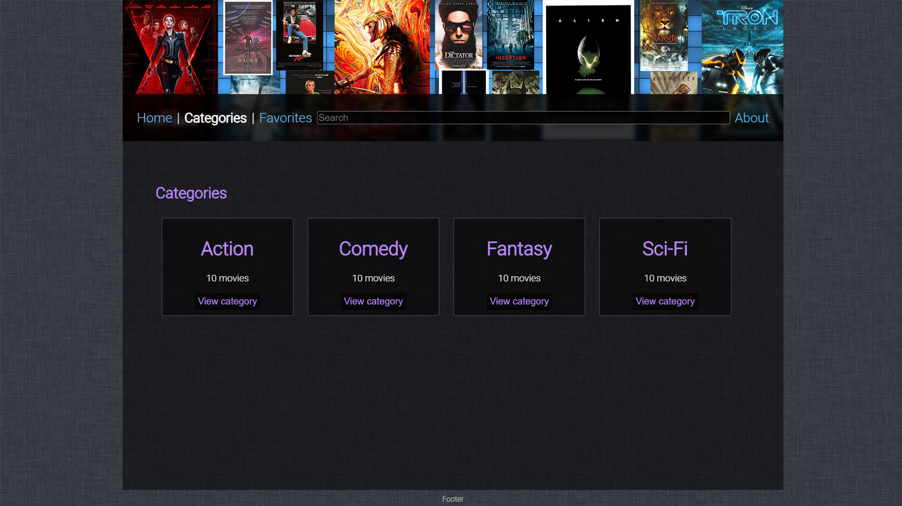
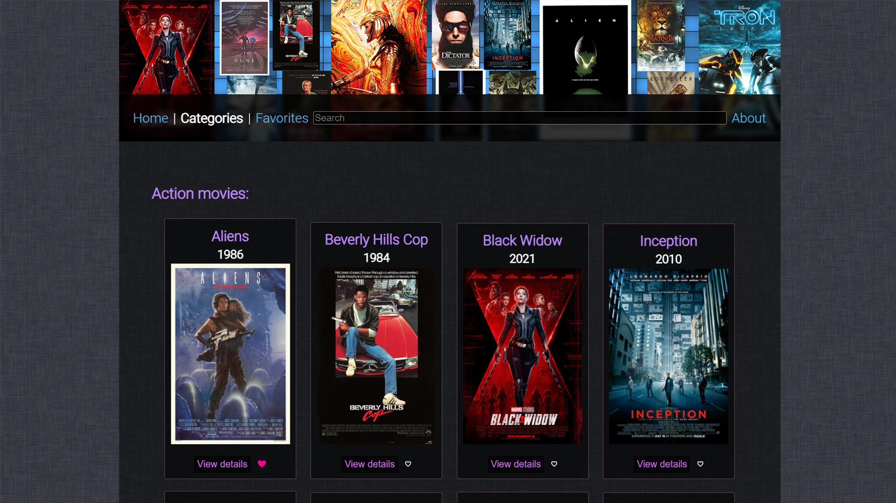
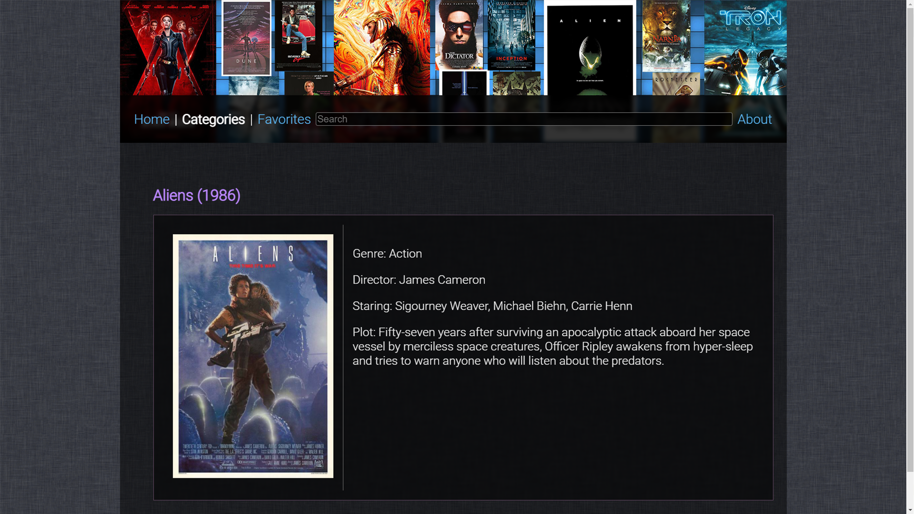
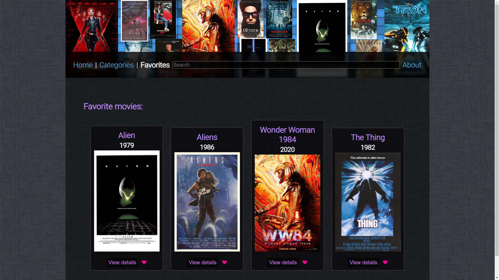
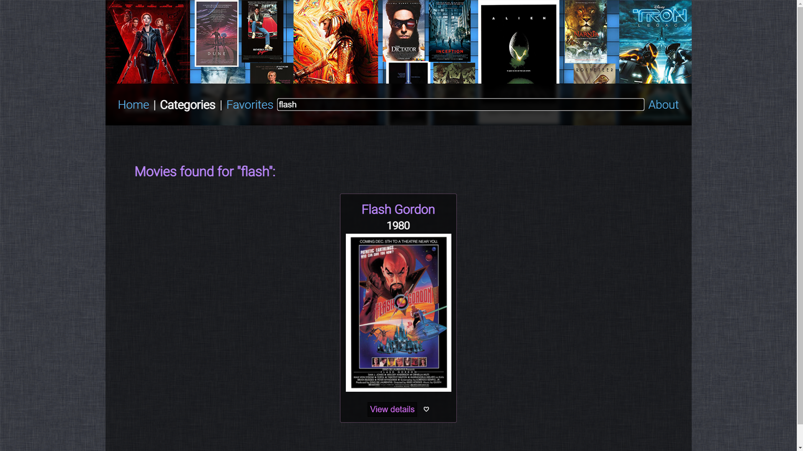
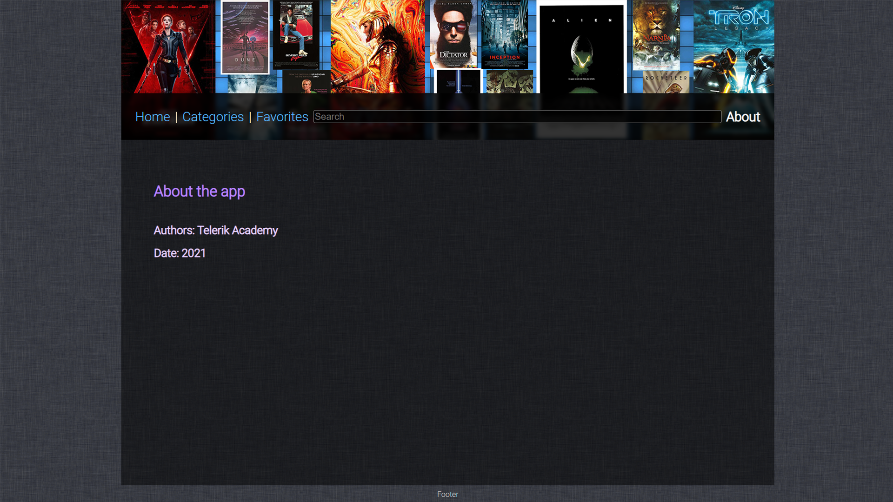
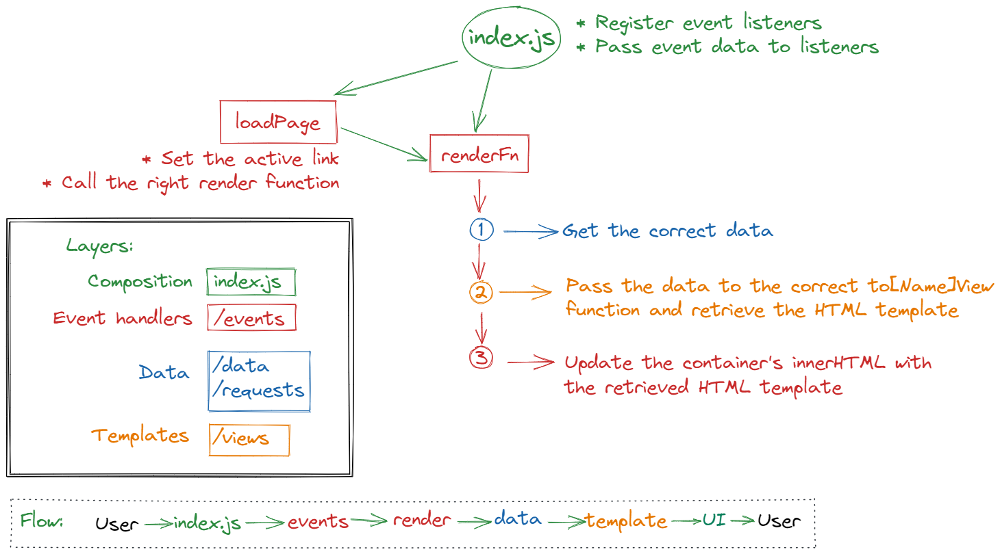

# Mov(e)ster

### 1. Description

Mov(e)ster is a simple web app for viewing and adding/removing movies from favorites. It's completely implemented with vanilla JavaScript (Native DOM API) and vanilla CSS (no libraries).

<br>

### 2. Project information

- Language and version: **JavaScript ES2020**
- Platform and version: **Node 14.0+**

<br>

### 3. Goals

You are provided with a partial implementation of the app. There is some styling, full data layer implementation (movies data and functions exposing the data in different formats with some filtering), partial event handler implementation and partial data-retrieval and view logic implementation.

The **goal** is to complete the implementation of the app by exercising the following:

- Working with HTML and CSS and styling different page views
- Working with individual and global event handlers
- Applying logic to specific element types within a global event handler
- Working with storing and retrieving data from `data` attributes
- Retrieving data from the data layer, converting it to a view and changing the currently displayed partial page view
- Following good practices:
  - Functions should be single-responsible - do one thing and do it well
  - Code should be short and readable
  - No magic strings and numbers - use constants instead

<br>

### 4. Full project view

The finished version of the app has the following views:

- home
- all categories list
- list of all movies in a specific category
- individual detailed movie view
- all favorite movies view
- searched movies view
- about view

**You do not need to match the styling displayed below, you're only required to display the same type of information in readable enough format.**

**There is detailed information about how to implement the views below. Do not start working until you have read it from end to end.**

<br>

#### 4.1 Home view

Home view has already been implemented. You need to finish it with adding CSS styling to make it look like this



<br>

#### 4.2 All categories list view

You need to implement the view and show all categories with the amount of movies in each category.



<br>

#### 4.3 List of all movies in a single category view

You need to implement the view and show simplified information for each movie in the category, along with the **favorite** status.



<br>

#### 4.4 Detailed movie view

You need to implement the view and show detailed information about the movie.



<br>

#### 4.5 Favorite movies view

You need to implement the view and show simplified information for each movie, along with the **favorite** status.



<br>

#### 4.6 Searched movies view

You need to implement the view and show simplified information for each movie matching the search word(s), along with the **favorite** status.



<br>

#### 4.7 About view

The about view is already implemented, you need to adjust the about information per your group.



<br>

### 5. Setup

You can work in the `template` folder or create your own **solution** folder and keep the `template` intact. To run the app make sure you have `live-server` installed **globally**.

1. Go inside the `template` folder (or your own work directory)
1. At root level (where the `index.html` is) run `live-server`
1. You are good to go

**Important:** Remember `live-server` will refresh the page whenever changes are saved to JavaScript and CSS files. Sometimes updating the CSS might trigger an error in the hot reload script - if that happens just refresh the page in the browser.

<br>

### 6. Project structure

- `images` - contains the images for styling the page
- `posters` - contains the poster images for the movies. They are moved in this folder not just for separation of concerns, but also because at some point the poster image will not be local for the project, i.e. inside the app's folder, but instead will be loaded from remote location, i.e. a server
- `styles` - contains the CSS files included in the app
- `src` - where the app's JavaScript code lives, inside you can find
  - `common/constants.js` - `common` holds resources used by other files, such resources are the constants in `constants.js`. Take a look at the file - remember the rule about no magic strings and numbers, and no hardcoded values?
  - `data` - holds the **data layer** of the app - we want to achieve separation of concerns. That means - hold the data in one place, the views in another, the event logic in a third place, etc. This separation allows us to replace each **layer** with another with little to no modification of the rest of the code. All of the data layer is already implemented for you. In this folder you can find:
    - `favorites.js` - the module responsible for adding and removing movies from favorites. It is based on the browser feature `localStorage`. Even though the implementation is complete, you can research more about the `localStorage` and how it can be useful for storing an retrieving data
    - `movies-data.js` - holds the raw movies and categories data. **You do not have direct access to the data**.
    - `movies.js` - this is the public movies data API which exposes controlled access to the movies and categories data. **You need to use it when you implement the data `request` logic**.
  - `events` - holds the core app logic. Event listeners in `index.js` use directly functions exposed in the `events` folder files. The role of those functions is to make a bridge between the data and the views, i.e. a function might have to retrieve all movies matching a search condition, create a view rendering the movies and displaying the created view. Inside the folder you can find:
    - `favorites-events.js` is already implemented for you. Its role is to react to the heart icon - switch the **favorite** status of a movie, i.e. add it to favorites or remove it. Its logic is very similar to the heart icon of post in [Telerik Academy Forum](https://forum.telerikacademy.com/)
    - `helpers.js` is already implemented too. It has some helpers methods including aliasing for `document.querySelector` and `document.querySelectorAll`
    - `navigation-events.js` is related to navigation events such as clicking on nav links (Home, Categories, etc.), buttons to show more of a category or a movie. You will need to complete the implementation of its functions
    - `search-events.js` is related to the searchbox and the search functionality
  - `requests-service.js` is the **service** file (services are another name for file providing some reusable functionality) providing access to the public API of the data layer. While in this template the data layer is inside the app, in the next exercise the data later will be completely moved to a server and the `request` service will be the place to access that data. You need to complete the implementation. Take a look at the `data/movies.js` to find what you can use.
  - `views` is the folder containing the view **templates**. **Templates** are partial html files (containing not a whole page, but a small meaningful part of it) which can have placeholders for data as well. Example of a view: `<p>This article has ${article.viewCount} views.</p>`. You can explore the files in the folder - they contain functions mapping data to (and returning) template views:
    - `about-view.js` has already implemented, you will only need to adjust it to match you're team names
    - `category-view.js` is partially implemented, you will need to finish the implementation
    - `favorites-view.js` is completely implemented, but depending on another function that hasn't been implemented
    - `home-view.js` is completely implemented
    - `movie-view.js` is partially implemented
    - `search-view.js` is partially implemented

<br>

### 7. Workflow

Do not try to implement the whole thing at once. Divide the problems into small chunks (this is already done for the better part thanks to the project architecture) and solve them one by one.

You can start with creating the individual views - HTML and CSS. When you open the `index.html` file you can see that there is an empty chunk left for templating:

```html
    <div id="container">
      <!-- start placeholders -->
      
      <!-- end placeholders -->
    </div>
```

When you assign individual views among the team members, each member can create a temporary version of the `index.html` and work inside that file to avoid conflict with others.

**When the app is complete do not forget to delete the temporary files.**

Each template might need to hold some data. You can find the types (expressed in TypeScript, as you see them in VS Code) of a single `category` and `movie` object below:

```ts
type category = {
  id: number,
  name: string,
}

type movie = {
  id: number,
  title: string,
  genre: string,
  year: number,
  description: string,
  director: string,
  stars: string[], // array of strings
  poster: string,
}
```

After you complete the templates and copy the templates inside the `views` folder you can focus on the rest of the logic.

<br>

### 8. App logic flow



The core app logic is very simple

1. User triggers an event by clicking/tapping on a element (link, button, heart icon, etc.)
1. When an event is raised it is handled by an event listener in `index.js`
1. Depending on the event type and the event's target element (or its class, id, etc.) a specific function from the `events` folder is called, i.e. when a nav link is clicked the `loadPage` is called with the value of the `data-page` attribute of the clicked element
1. The appropriate event function from the `events` folder either:
    - updates the view from a template in `views` (Home, About)
    - retrieves data from the `request` service and updates the view from a template in `views` depending on that data (and the template)
1. The view is updated and the user can trigger an new event

You can follow the already implemented navigation event called on elements with the class `nav-link` and specifically how the Home page is loaded. The rest of the events and event handlers follow the same logic.

<br>

### 9. Problems to solve

This is a great exercise for your problem solving skills. Since parts of the app have already been implemented providing insight on the rest of implementation, you need to pay attention to what is already in. A few problems you might stumble upon:

- read the **documentation** carefully - everything you need is already shown in the existing implementation or provided in the readme file
- **do not rush it** - there is no pressure to complete everything at once
- **divide and conquer** - split the work in small problems and solve them one by one, do not forget to discuss
- do not overdue on design - make it look readable and usable, there is no need to make the perfect template design
- make full use of JavaScript template strings
- make full use of array methods - map/filter/reduce
- do not try to use every tool available - you do not need filter or reduce
- make full use of HTML `data` attributes - if you need to pass a movie or category information, you can add it to a button or a link and retrieve it in the event's target element
- read the documentation carefully

<br>

### 10. Work requirements

Every member of the team must complete at least two of the three:

- implement a template/view
- implement an event function
- implement a request service function

Explicit listing:

1. Templates/views:

    - `toSingleCategoryView(category)`
    - `toSingleMovieView(movie)`
    - `toMovieSimple(movie)`
    - `toMovieDetailed(movie)`

1. Event functions:

    - `loadPage(page)`
    - `renderMovieDetails(id)`
    - `renderCategory(categoryId)`
    - `renderCategories()`
    - `renderFavorites()`
    - `renderAbout()`
    - `renderSearchItems(searchTerm)`

1. Request service functions:

    - `loadCategories()`
    - `loadMovies(categoryId)`
    - `loadSingleMovie(id)`
    - `loadSearchMovies(searchTerm)`

<br>

Best of luck!